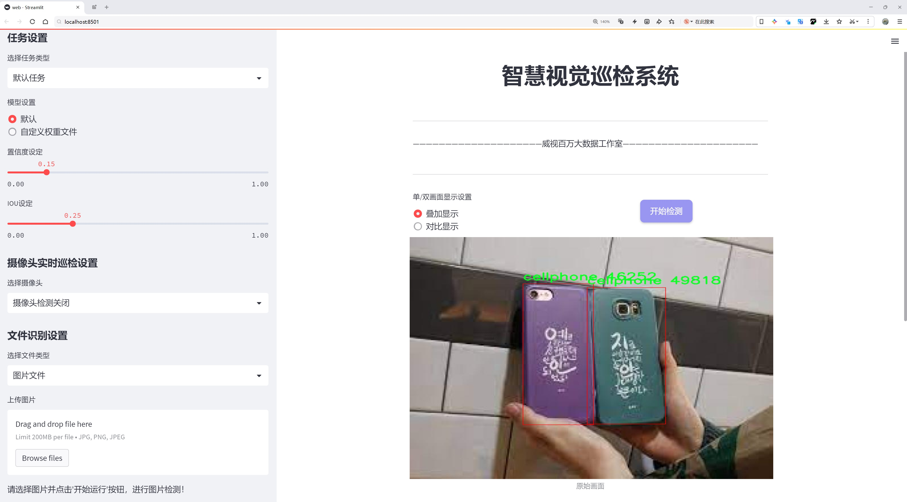

# 日常物品检测检测系统源码分享
 # [一条龙教学YOLOV8标注好的数据集一键训练_70+全套改进创新点发刊_Web前端展示]

### 1.研究背景与意义

项目参考[AAAI Association for the Advancement of Artificial Intelligence](https://gitee.com/qunmasj/projects)

项目来源[AACV Association for the Advancement of Computer Vision](https://kdocs.cn/l/cszuIiCKVNis)

研究背景与意义

随着人工智能技术的迅猛发展，计算机视觉作为其重要分支之一，正逐渐渗透到我们日常生活的各个领域。物体检测技术，尤其是在智能监控、自动驾驶、智能家居等应用场景中，发挥着越来越重要的作用。YOLO（You Only Look Once）系列模型因其高效的实时检测能力和较高的准确率，成为了物体检测领域的研究热点。YOLOv8作为该系列的最新版本，结合了深度学习的最新进展，展现出了更强的性能和更广泛的应用潜力。然而，尽管YOLOv8在许多复杂场景中表现出色，但在日常物品的检测任务中，仍然存在一些挑战，尤其是在物品种类繁多、背景复杂的情况下。

本研究旨在基于改进的YOLOv8模型，构建一个高效的日常物品检测系统。我们所使用的数据集包含4404张图像，涵盖了7个类别的物品，包括书籍、瓶子、手机、椅子、笔和人。这些物品在日常生活中频繁出现，且具有一定的多样性和复杂性。通过对这些物品的检测，不仅可以提升物体识别的准确性，还能为后续的智能应用提供基础数据支持。例如，在智能家居系统中，准确识别家居物品可以实现更为智能的家居管理和服务；在零售行业，物品检测可以帮助商家进行库存管理和顾客行为分析。

在此背景下，改进YOLOv8模型的必要性愈发凸显。我们计划通过优化模型结构、调整超参数以及增强数据集等手段，提升模型在日常物品检测中的表现。具体而言，针对数据集中物品类别的多样性和图像背景的复杂性，我们将采用数据增强技术，以增加模型的鲁棒性。此外，针对YOLOv8在小物体检测方面的不足，我们将引入特征金字塔网络（FPN）等技术，以提高模型对小物体的识别能力。

本研究的意义不仅在于提升YOLOv8在日常物品检测任务中的性能，更在于为物体检测技术的实际应用提供新的思路和方法。通过构建一个高效的日常物品检测系统，我们希望能够推动物体检测技术在智能家居、安防监控、智能零售等领域的广泛应用，进而提升人们的生活质量和工作效率。此外，本研究的成果还将为后续的相关研究提供有价值的参考，促进物体检测技术的进一步发展。

综上所述，基于改进YOLOv8的日常物品检测系统的研究，不仅具有重要的理论价值，也具备广泛的应用前景。通过对日常物品的精准识别与检测，我们将为智能化社会的构建贡献一份力量。

### 2.图片演示




##### 注意：由于此博客编辑较早，上面“2.图片演示”和“3.视频演示”展示的系统图片或者视频可能为老版本，新版本在老版本的基础上升级如下：（实际效果以升级的新版本为准）

  （1）适配了YOLOV8的“目标检测”模型和“实例分割”模型，通过加载相应的权重（.pt）文件即可自适应加载模型。

  （2）支持“图片识别”、“视频识别”、“摄像头实时识别”三种识别模式。

  （3）支持“图片识别”、“视频识别”、“摄像头实时识别”三种识别结果保存导出，解决手动导出（容易卡顿出现爆内存）存在的问题，识别完自动保存结果并导出到tempDir中。

  （4）支持Web前端系统中的标题、背景图等自定义修改，后面提供修改教程。

  另外本项目提供训练的数据集和训练教程,暂不提供权重文件（best.pt）,需要您按照教程进行训练后实现图片演示和Web前端界面演示的效果。

### 3.视频演示

[3.1 视频演示](https://www.bilibili.com/video/BV19atUeWETz/)

### 4.数据集信息展示

##### 4.1 本项目数据集详细数据（类别数＆类别名）

nc: 7
names: ['3', 'book', 'bottle', 'cellphone', 'chair', 'pen', 'person']


##### 4.2 本项目数据集信息介绍

数据集信息展示

在本研究中，我们使用了名为“object detection task”的数据集，以改进YOLOv8在日常物品检测系统中的表现。该数据集包含七个类别，具体包括：数字“3”、书籍、瓶子、手机、椅子、钢笔以及人。这些类别的选择旨在涵盖我们日常生活中常见的物品，确保模型在实际应用中的有效性和可靠性。

首先，数据集中包含的类别“3”作为一个独特的元素，可能代表特定的场景或对象识别需求。这一类别的存在不仅增加了数据集的多样性，也为模型的训练提供了更多的挑战，促使其在处理复杂场景时能够更好地进行区分和识别。书籍作为一种文化和知识的载体，其在日常生活中的普遍性使得它成为了重要的检测对象。通过对书籍的检测，模型能够学习到如何识别不同形状、颜色和尺寸的物体，从而提升其在多样化环境中的适应能力。

瓶子作为日常生活中常见的容器，种类繁多，包括水瓶、饮料瓶等。这一类别的引入使得模型需要掌握对透明和不透明物体的识别能力，尤其是在复杂背景下，如何准确区分不同类型的瓶子将是对模型的一大考验。手机则是现代生活中不可或缺的电子产品，其形状和尺寸相对固定，但不同品牌和型号的手机在外观上存在显著差异，这为模型的学习提供了丰富的样本和挑战。

椅子作为一种家具，其设计风格和形状各异，涵盖了从简约到复杂的多种形式。通过对椅子的检测，模型不仅需要识别物体的基本形状，还要能够理解不同椅子在不同环境中的相对位置和姿态。钢笔作为一种常见的书写工具，其小巧的体积和多样的设计风格也为模型的训练增添了难度。模型需要学习如何在各种背景下准确识别出钢笔，尤其是在与其他物体相互重叠或遮挡的情况下。

最后，类别“人”的引入则是对模型进行人类行为识别的一个重要补充。人类的存在往往会影响周围物体的布局和识别，因此模型需要具备一定的上下文理解能力，以便在检测其他物体时考虑到人的位置和动作。这一类别的多样性也要求模型能够处理不同姿态、服装和肤色的人，提升其在现实场景中的适应性。

综上所述，“object detection task”数据集的设计不仅考虑到了物体的多样性和复杂性，还强调了在实际应用中对模型性能的全面提升。通过对这七个类别的深入学习，YOLOv8模型将能够在日常物品检测中展现出更高的准确性和鲁棒性，为智能监控、自动驾驶等领域的应用奠定坚实的基础。数据集的多样性和挑战性将推动我们在物体检测技术上的不断进步，助力实现更智能的视觉识别系统。


### 5.全套项目环境部署视频教程（零基础手把手教学）

[5.1 环境部署教程链接（零基础手把手教学）](https://www.ixigua.com/7404473917358506534?logTag=c807d0cbc21c0ef59de5)


[5.2 安装Python虚拟环境创建和依赖库安装视频教程链接（零基础手把手教学）](https://www.ixigua.com/7404474678003106304?logTag=1f1041108cd1f708b01a)

### 6.手把手YOLOV8训练视频教程（零基础小白有手就能学会）

[6.1 手把手YOLOV8训练视频教程（零基础小白有手就能学会）](https://www.ixigua.com/7404477157818401292?logTag=d31a2dfd1983c9668658)

### 7.70+种全套YOLOV8创新点代码加载调参视频教程（一键加载写好的改进模型的配置文件）

[7.1 70+种全套YOLOV8创新点代码加载调参视频教程（一键加载写好的改进模型的配置文件）](https://www.ixigua.com/7404478314661806627?logTag=29066f8288e3f4eea3a4)

### 8.70+种全套YOLOV8创新点原理讲解（非科班也可以轻松写刊发刊，V10版本正在科研待更新）

由于篇幅限制，每个创新点的具体原理讲解就不一一展开，具体见下列网址中的创新点对应子项目的技术原理博客网址【Blog】：


[8.1 70+种全套YOLOV8创新点原理讲解链接](https://gitee.com/qunmasj/good)

### 9.系统功能展示（检测对象为举例，实际内容以本项目数据集为准）

图9.1.系统支持检测结果表格显示

  图9.2.系统支持置信度和IOU阈值手动调节

  图9.3.系统支持自定义加载权重文件best.pt(需要你通过步骤5中训练获得)

  图9.4.系统支持摄像头实时识别

  图9.5.系统支持图片识别

  图9.6.系统支持视频识别

  图9.7.系统支持识别结果文件自动保存

  图9.8.系统支持Excel导出检测结果数据


### 10.原始YOLOV8算法原理

原始YOLOv8算法原理

YOLOv8作为YOLO系列的最新版本，标志着目标检测技术的又一次重要进步。它不仅在算法结构上进行了深度优化，还在特征提取和目标检测的效率上实现了显著提升。YOLOv8的核心思想依然是将目标检测视为一个回归问题，直接从图像像素到边界框和类别概率的映射，而不依赖于传统的滑动窗口或区域提议方法。这种方法使得YOLOv8在速度和精度上都表现得更加优越。

在YOLOv8的架构中，模型主要由三个部分组成：Backbone、Neck和Head。Backbone负责特征提取，采用了CSPDarknet（Cross Stage Partial Darknet）结构。该结构的设计理念是通过分段的方式将网络分为两个部分，每个部分都包含多个残差块，以此来提高特征提取的效率和深度。相较于前代模型YOLOv5，YOLOv8引入了C2f模块，替代了C3模块。C2f模块的独特之处在于它将输入特征图分为两个分支，每个分支经过卷积层进行降维处理，同时通过v8_C2fBottleneck层进行特征的进一步提炼和融合。这种设计不仅增强了特征图的维度，也提升了梯度流的传递效率，使得模型在训练过程中能够更好地捕捉到重要的特征信息。

在特征提取的过程中，YOLOv8还引入了快速空间金字塔池化（SPPF）结构。这一结构的优势在于能够有效提取不同尺度的特征，同时减少模型的参数量和计算量。通过这种方式，YOLOv8在处理多尺度目标时，能够更灵活地适应不同大小的物体，从而提高了检测的准确性和鲁棒性。

在目标检测部分，YOLOv8采用了特征金字塔网络（FPN）与路径聚合网络（PAN）的结合。这一结构通过多个卷积层和池化层对特征图进行处理和压缩，确保了不同层次的特征信息能够有效地融合在一起。最终，YOLOv8通过全连接层将处理后的特征图转换为目标检测结果，直接预测目标的中心点及其宽高比例。这种基于无锚框（Anchor-Free）的检测方式，不仅减少了Anchor框的数量，还显著提高了检测速度和准确度。

YOLOv8在训练过程中引入了多尺度训练和测试的策略，这使得模型在面对不同尺寸的目标时，能够保持较高的检测性能。通过在不同尺度下进行训练，YOLOv8能够学习到更丰富的特征表示，从而在实际应用中表现得更加灵活和高效。

值得一提的是，YOLOv8在性能上也取得了显著的提升。与之前的版本相比，YOLOv8在精度（mAP）和帧率上均呈现出递增的趋势。与SSD等传统目标检测算法相比，YOLOv8的精度提高了43.23%，帧率则提升了10.28倍。这一系列的改进使得YOLOv8在各种应用场景中，如智能监控、自动驾驶和人脸识别等，均能展现出优异的性能。

总的来说，YOLOv8的原始算法原理在于通过深度的卷积神经网络结构，结合高效的特征提取和目标检测机制，实现了对目标的快速、准确检测。其创新的C2f模块、SPPF结构以及无锚框检测方式，均为提升模型性能提供了强有力的支持。随着YOLOv8的推出，目标检测技术进入了一个新的阶段，未来在更多复杂场景中的应用潜力也将不断被挖掘和拓展。


### 11.项目核心源码讲解（再也不用担心看不懂代码逻辑）

#### 11.1 ui.py

以下是对给定代码的核心部分进行提炼和详细注释的版本：

```python
import sys
import subprocess

def run_script(script_path):
    """
    使用当前 Python 环境运行指定的脚本。

    Args:
        script_path (str): 要运行的脚本路径

    Returns:
        None
    """
    # 获取当前 Python 解释器的路径
    python_path = sys.executable

    # 构建运行命令，使用 streamlit 运行指定的脚本
    command = f'"{python_path}" -m streamlit run "{script_path}"'

    # 执行命令
    result = subprocess.run(command, shell=True)
    
    # 检查命令执行结果，如果返回码不为0，则表示出错
    if result.returncode != 0:
        print("脚本运行出错。")

# 主程序入口
if __name__ == "__main__":
    # 指定要运行的脚本路径
    script_path = "web.py"  # 这里假设脚本在当前目录下

    # 调用函数运行脚本
    run_script(script_path)
```

### 代码核心部分说明：

1. **导入模块**：
   - `sys`：用于获取当前 Python 解释器的路径。
   - `subprocess`：用于执行外部命令。

2. **`run_script` 函数**：
   - 接收一个脚本路径作为参数，并在当前 Python 环境中运行该脚本。
   - 使用 `sys.executable` 获取当前 Python 解释器的路径，以确保使用正确的 Python 环境。
   - 构建一个命令字符串，使用 `streamlit` 运行指定的脚本。
   - 使用 `subprocess.run` 执行构建的命令，并检查返回码以判断脚本是否成功运行。

3. **主程序入口**：
   - 当脚本作为主程序运行时，指定要运行的脚本路径（这里假设为 `web.py`）。
   - 调用 `run_script` 函数执行指定的脚本。 

### 注意事项：
- 该代码假设 `web.py` 脚本在当前工作目录下，实际使用时可以根据需要调整路径。
- `subprocess.run` 的 `shell=True` 参数使得命令在 shell 中执行，可能存在安全隐患，特别是当脚本路径来自不可信的输入时。

这个程序文件名为 `ui.py`，其主要功能是通过当前的 Python 环境运行一个指定的脚本，具体来说是一个名为 `web.py` 的脚本。文件中首先导入了必要的模块，包括 `sys`、`os` 和 `subprocess`，这些模块分别用于访问系统特性、操作系统功能和执行外部命令。

在文件的主体部分，定义了一个名为 `run_script` 的函数，该函数接受一个参数 `script_path`，表示要运行的脚本的路径。函数内部首先获取当前 Python 解释器的路径，使用 `sys.executable` 可以获取到当前 Python 环境的可执行文件路径。接着，构建一个命令字符串，使用 `streamlit` 模块来运行指定的脚本。命令的格式是 `"{python_path}" -m streamlit run "{script_path}"`，其中 `{python_path}` 和 `{script_path}` 分别被替换为实际的 Python 解释器路径和脚本路径。

随后，使用 `subprocess.run` 方法执行构建好的命令。这个方法会在一个新的进程中运行命令，并等待其完成。如果命令执行的返回码不为零，表示脚本运行过程中出现了错误，程序会打印出“脚本运行出错”的提示信息。

在文件的最后部分，使用 `if __name__ == "__main__":` 语句来确保只有在直接运行该文件时才会执行以下代码。这部分代码指定了要运行的脚本路径，这里使用了 `abs_path` 函数来获取 `web.py` 的绝对路径。然后调用 `run_script` 函数来执行这个脚本。

总体来说，这个程序的功能是封装了一个简单的命令行工具，用于启动一个基于 Streamlit 的 Web 应用，提供了一种便捷的方式来运行 Python 脚本。

#### 11.2 predict.py

以下是代码中最核心的部分，并附上详细的中文注释：

```python
from ultralytics.engine.predictor import BasePredictor
from ultralytics.engine.results import Results
from ultralytics.utils import ops

class DetectionPredictor(BasePredictor):
    """
    DetectionPredictor类扩展了BasePredictor类，用于基于检测模型进行预测。
    """

    def postprocess(self, preds, img, orig_imgs):
        """对预测结果进行后处理，并返回Results对象的列表。"""
        
        # 使用非极大值抑制（NMS）来过滤重叠的检测框
        preds = ops.non_max_suppression(
            preds,  # 预测框
            self.args.conf,  # 置信度阈值
            self.args.iou,  # IOU阈值
            agnostic=self.args.agnostic_nms,  # 是否使用类别无关的NMS
            max_det=self.args.max_det,  # 最大检测框数量
            classes=self.args.classes,  # 需要检测的类别
        )

        # 如果输入的原始图像不是列表，说明它是一个torch.Tensor，需要转换为numpy数组
        if not isinstance(orig_imgs, list):
            orig_imgs = ops.convert_torch2numpy_batch(orig_imgs)

        results = []  # 存储处理后的结果
        for i, pred in enumerate(preds):  # 遍历每个预测结果
            orig_img = orig_imgs[i]  # 获取对应的原始图像
            # 将预测框的坐标从缩放后的图像大小转换回原始图像大小
            pred[:, :4] = ops.scale_boxes(img.shape[2:], pred[:, :4], orig_img.shape)
            img_path = self.batch[0][i]  # 获取图像路径
            # 创建Results对象并添加到结果列表中
            results.append(Results(orig_img, path=img_path, names=self.model.names, boxes=pred))
        
        return results  # 返回处理后的结果列表
```

### 代码注释说明：
1. **导入模块**：导入必要的类和函数，以便在后续的代码中使用。
2. **DetectionPredictor类**：这是一个扩展自`BasePredictor`的类，专门用于处理检测模型的预测。
3. **postprocess方法**：该方法用于对模型的预测结果进行后处理，包括非极大值抑制和坐标缩放等操作。
4. **非极大值抑制**：通过`ops.non_max_suppression`函数来过滤掉重叠的检测框，保留最有可能的检测结果。
5. **图像格式转换**：如果原始图像不是列表格式，则将其转换为numpy数组，以便后续处理。
6. **结果收集**：遍历每个预测结果，调整预测框的坐标，并将每个结果存储在`Results`对象中，最终返回所有结果的列表。

这个程序文件 `predict.py` 是一个用于目标检测的预测类，名为 `DetectionPredictor`，它继承自 `BasePredictor` 类。该类的主要功能是基于给定的检测模型进行预测，并对预测结果进行后处理。

在文件的开头，导入了必要的模块，包括 `BasePredictor`、`Results` 和一些实用的操作函数 `ops`。这些模块来自于 `ultralytics` 库，后者是一个用于实现 YOLO（You Only Look Once）目标检测算法的框架。

`DetectionPredictor` 类的文档字符串中提供了一个使用示例，展示了如何使用该类进行预测。示例中，首先导入必要的模块，然后创建一个包含模型路径和数据源的参数字典 `args`。接着，实例化 `DetectionPredictor` 对象，并调用 `predict_cli()` 方法进行预测。

类中的 `postprocess` 方法是核心功能之一，它负责对模型的预测结果进行后处理。该方法接受三个参数：`preds`（模型的预测结果）、`img`（输入图像）和 `orig_imgs`（原始图像）。在方法内部，首先调用 `ops.non_max_suppression` 函数对预测结果进行非极大值抑制，以去除冗余的框，保留最有可能的检测结果。这个过程使用了一些参数，如置信度阈值、IOU（Intersection over Union）阈值、是否使用类别无关的 NMS 以及最大检测数量等。

接下来，方法检查 `orig_imgs` 是否为列表，如果不是，则将其转换为 NumPy 数组。然后，方法遍历每个预测结果，并根据原始图像的尺寸对预测框进行缩放。最后，将每个预测结果封装成 `Results` 对象，并返回一个包含所有结果的列表。

总体而言，这个文件定义了一个用于目标检测的预测类，能够处理模型的输出并生成可用的检测结果，适合于在图像上进行目标检测任务。

#### 11.3 code\ultralytics\utils\downloads.py

以下是经过简化并注释的核心代码部分，主要保留了文件下载、解压和相关的辅助函数：

```python
import contextlib
import re
import shutil
import subprocess
from pathlib import Path
from urllib import parse, request
import requests
import torch
from ultralytics.utils import LOGGER, TQDM

def is_url(url, check=True):
    """
    验证给定字符串是否为有效的URL，并可选地检查该URL是否在线。

    Args:
        url (str): 要验证的字符串。
        check (bool, optional): 如果为True，则检查URL是否在线。默认值为True。

    Returns:
        (bool): 如果字符串是有效的URL，则返回True。如果'check'为True，还会检查URL是否在线。
    """
    with contextlib.suppress(Exception):
        url = str(url)
        result = parse.urlparse(url)
        assert all([result.scheme, result.netloc])  # 检查是否为URL
        if check:
            with request.urlopen(url) as response:
                return response.getcode() == 200  # 检查URL是否存在
        return True
    return False

def safe_download(url, file=None, dir=None, unzip=True, delete=False, retry=3, progress=True):
    """
    从URL下载文件，支持重试、解压和删除下载的文件。

    Args:
        url (str): 要下载的文件的URL。
        file (str, optional): 下载文件的文件名。如果未提供，将使用URL中的文件名。
        dir (str, optional): 保存下载文件的目录。如果未提供，将保存在当前工作目录中。
        unzip (bool, optional): 是否解压下载的文件。默认值为True。
        delete (bool, optional): 是否在解压后删除下载的文件。默认值为False。
        retry (int, optional): 下载失败时的重试次数。默认值为3。
        progress (bool, optional): 是否在下载过程中显示进度条。默认值为True。

    Returns:
        (Path): 解压后的目录路径。
    """
    f = Path(dir or ".") / (file or url2file(url))  # 生成文件路径
    if not f.is_file():  # 如果文件不存在
        desc = f"Downloading {url} to '{f}'"
        LOGGER.info(f"{desc}...")
        f.parent.mkdir(parents=True, exist_ok=True)  # 创建目录
        for i in range(retry + 1):
            try:
                # 使用torch下载文件
                torch.hub.download_url_to_file(url, f, progress=progress)
                if f.exists() and f.stat().st_size > 0:  # 检查文件是否成功下载
                    break
            except Exception as e:
                if i >= retry:
                    raise ConnectionError(f"下载失败: {url}") from e
                LOGGER.warning(f"下载失败，重试 {i + 1}/{retry} {url}...")

    if unzip and f.exists() and f.suffix in (".zip", ".tar", ".gz"):
        unzip_dir = dir or f.parent  # 解压到指定目录或当前目录
        unzip_file(file=f, path=unzip_dir)  # 解压文件
        if delete:
            f.unlink()  # 删除zip文件
    return unzip_dir

def unzip_file(file, path=None):
    """
    解压缩指定的zip文件到指定路径。

    Args:
        file (str): 要解压的zip文件路径。
        path (str, optional): 解压到的目标路径。如果未提供，使用zip文件的父目录。

    Returns:
        (Path): 解压后的目录路径。
    """
    from zipfile import ZipFile
    if path is None:
        path = Path(file).parent  # 默认路径为zip文件的父目录

    with ZipFile(file) as zipObj:
        zipObj.extractall(path)  # 解压所有文件
    return path  # 返回解压目录路径
```

### 代码说明
1. **is_url**: 该函数用于验证给定字符串是否为有效的URL，并可选择性地检查该URL是否在线。
2. **safe_download**: 该函数负责从指定的URL下载文件，支持重试机制、解压缩文件以及在解压后删除原始压缩文件。
3. **unzip_file**: 该函数用于解压缩指定的zip文件到给定的路径。

以上是代码的核心部分，其他辅助功能和具体实现细节可以根据需要进行扩展。

这个程序文件 `downloads.py` 是 Ultralytics YOLO 项目的一部分，主要用于处理文件的下载、解压和相关的文件管理操作。以下是对代码的详细说明。

首先，文件导入了一些必要的库，包括处理文件路径的 `Path`、进行网络请求的 `requests`、以及用于多线程处理的 `ThreadPool`。此外，还引入了一些 Ultralytics 自定义的工具函数和日志记录器。

文件中定义了一些常量，主要是 GitHub 上的模型文件名和路径。这些文件名包括不同版本的 YOLO 模型和其他相关模型，方便后续的下载和管理。

接下来，定义了一些函数：

1. **is_url**：验证给定字符串是否为有效的 URL，并可选择性地检查该 URL 是否在线。使用 `urlparse` 解析 URL，并通过 `urlopen` 检查其状态码。

2. **delete_dsstore**：删除指定目录下的 `.DS_Store` 文件，这些文件是 macOS 系统生成的隐藏文件，可能在不同操作系统间传输时造成问题。

3. **zip_directory**：将指定目录的内容压缩为 ZIP 文件，支持排除特定文件，并可选择显示进度条。

4. **unzip_file**：解压缩 ZIP 文件到指定路径，支持排除特定文件，并处理文件夹结构。

5. **check_disk_space**：检查是否有足够的磁盘空间来下载文件。根据文件的大小和一个安全因子，判断是否可以继续下载。

6. **get_google_drive_file_info**：从 Google Drive 的分享链接中提取直接下载链接和文件名，处理下载配额超限的情况。

7. **safe_download**：从 URL 下载文件，支持重试、解压和删除下载后的文件。根据 URL 类型（如 Google Drive）处理不同的下载逻辑。

8. **get_github_assets**：从指定的 GitHub 仓库获取版本标签和资产列表，支持获取最新版本的资产。

9. **attempt_download_asset**：尝试从 GitHub 下载指定的文件，如果本地不存在则进行下载，支持处理 URL 和文件名。

10. **download**：下载指定 URL 的文件，支持并发下载，处理解压和删除 ZIP 文件的选项。

整体来看，这个文件提供了一系列工具函数，方便用户从网络上下载模型文件、处理文件和目录的管理，以及确保下载过程的顺利进行。通过这些函数，用户可以方便地获取和管理机器学习模型，尤其是在使用 YOLO 系列模型时。

#### 11.4 code\ultralytics\utils\callbacks\raytune.py

以下是经过简化和注释的核心代码部分：

```python
# 导入必要的库和模块
from ultralytics.utils import SETTINGS

# 尝试导入Ray和Tune库，并验证Ray Tune集成是否启用
try:
    assert SETTINGS["raytune"] is True  # 确保Ray Tune集成已启用
    import ray
    from ray import tune
    from ray.air import session
except (ImportError, AssertionError):
    tune = None  # 如果导入失败或集成未启用，则将tune设置为None

def on_fit_epoch_end(trainer):
    """在每个训练周期结束时，将训练指标发送到Ray Tune。"""
    if ray.tune.is_session_enabled():  # 检查Ray Tune会话是否启用
        metrics = trainer.metrics  # 获取当前训练指标
        metrics["epoch"] = trainer.epoch  # 将当前周期数添加到指标中
        session.report(metrics)  # 向Ray Tune报告指标

# 定义回调函数，如果tune可用，则包含on_fit_epoch_end回调
callbacks = (
    {
        "on_fit_epoch_end": on_fit_epoch_end,  # 训练周期结束时的回调
    }
    if tune
    else {}  # 如果tune不可用，则回调为空
)
```

### 代码注释说明：
1. **导入模块**：首先导入必要的模块和设置。
2. **集成验证**：通过`assert`语句检查Ray Tune的集成是否启用，如果未启用或导入失败，则将`tune`设置为`None`。
3. **回调函数**：定义`on_fit_epoch_end`函数，该函数在每个训练周期结束时被调用，用于将训练指标发送到Ray Tune。
4. **指标报告**：在回调函数中，检查Ray Tune会话是否启用，如果启用，则获取当前的训练指标并报告。
5. **回调字典**：根据`tune`的可用性定义回调字典，如果`tune`可用，则包含`on_fit_epoch_end`回调。

这个程序文件是用于集成Ultralytics YOLO与Ray Tune的回调函数，主要目的是在每个训练周期结束时将训练指标发送到Ray Tune，以便进行超参数调优和模型性能监控。

首先，文件引入了Ultralytics的设置模块`SETTINGS`，并通过一个`try`语句块来检查Ray Tune的集成是否启用。具体来说，它通过断言`SETTINGS["raytune"]`是否为`True`来验证这一点。如果集成启用，则导入Ray库及其相关模块`tune`和`session`。如果导入失败或集成未启用，则将`tune`设置为`None`。

接下来，定义了一个名为`on_fit_epoch_end`的函数，这个函数在每个训练周期结束时被调用。函数内部首先检查Ray Tune的会话是否已启用。如果启用，则从训练器`trainer`中获取当前的训练指标，并将当前的周期数添加到指标中。最后，使用`session.report(metrics)`将这些指标报告给Ray Tune。

最后，文件定义了一个名为`callbacks`的元组。如果`tune`被成功导入（即Ray Tune集成可用），则将`on_fit_epoch_end`函数作为回调函数添加到元组中；否则，`callbacks`将是一个空字典。这种设计使得在使用Ray Tune时能够灵活地添加训练回调，而在不使用时则不会影响程序的其他部分。

#### 11.5 code\ultralytics\models\yolo\pose\val.py

以下是代码中最核心的部分，并附上详细的中文注释：

```python
class PoseValidator(DetectionValidator):
    """
    PoseValidator类，继承自DetectionValidator类，用于基于姿态模型的验证。
    """

    def __init__(self, dataloader=None, save_dir=None, pbar=None, args=None, _callbacks=None):
        """初始化PoseValidator对象，设置自定义参数和属性。"""
        super().__init__(dataloader, save_dir, pbar, args, _callbacks)  # 调用父类构造函数
        self.sigma = None  # 初始化sigma，用于计算关键点的OKS
        self.kpt_shape = None  # 初始化关键点形状
        self.args.task = "pose"  # 设置任务类型为姿态估计
        self.metrics = PoseMetrics(save_dir=self.save_dir, on_plot=self.on_plot)  # 初始化姿态评估指标

    def preprocess(self, batch):
        """预处理批次数据，将关键点数据转换为浮点数并移动到指定设备。"""
        batch = super().preprocess(batch)  # 调用父类的预处理方法
        batch["keypoints"] = batch["keypoints"].to(self.device).float()  # 将关键点数据移动到设备并转换为浮点数
        return batch

    def postprocess(self, preds):
        """应用非极大值抑制，返回高置信度的检测结果。"""
        return ops.non_max_suppression(
            preds,
            self.args.conf,  # 置信度阈值
            self.args.iou,  # IOU阈值
            labels=self.lb,
            multi_label=True,
            agnostic=self.args.single_cls,
            max_det=self.args.max_det,
            nc=self.nc,
        )

    def update_metrics(self, preds, batch):
        """更新评估指标。"""
        for si, pred in enumerate(preds):  # 遍历每个预测结果
            self.seen += 1  # 记录已处理的样本数量
            npr = len(pred)  # 当前预测的数量
            stat = dict(
                conf=torch.zeros(0, device=self.device),  # 初始化置信度
                pred_cls=torch.zeros(0, device=self.device),  # 初始化预测类别
                tp=torch.zeros(npr, self.niou, dtype=torch.bool, device=self.device),  # 初始化真阳性
                tp_p=torch.zeros(npr, self.niou, dtype=torch.bool, device=self.device),  # 初始化姿态真阳性
            )
            pbatch = self._prepare_batch(si, batch)  # 准备当前批次数据
            cls, bbox = pbatch.pop("cls"), pbatch.pop("bbox")  # 获取类别和边界框
            
            if npr == 0:  # 如果没有预测结果
                if len(cls):  # 如果有真实类别
                    for k in self.stats.keys():
                        self.stats[k].append(stat[k])  # 更新统计信息
                continue  # 跳过当前循环

            predn, pred_kpts = self._prepare_pred(pred, pbatch)  # 准备预测结果和关键点
            stat["conf"] = predn[:, 4]  # 获取置信度
            stat["pred_cls"] = predn[:, 5]  # 获取预测类别

            if len(cls):  # 如果有真实类别
                stat["tp"] = self._process_batch(predn, bbox, cls)  # 处理边界框
                stat["tp_p"] = self._process_batch(predn, bbox, cls, pred_kpts, pbatch["kpts"])  # 处理关键点
            for k in self.stats.keys():
                self.stats[k].append(stat[k])  # 更新统计信息

    def _process_batch(self, detections, gt_bboxes, gt_cls, pred_kpts=None, gt_kpts=None):
        """
        返回正确的预测矩阵。

        参数:
            detections (torch.Tensor): 形状为[N, 6]的检测结果张量。
            gt_bboxes (torch.Tensor): 形状为[M, 5]的真实标签张量。
            pred_kpts (torch.Tensor, 可选): 形状为[N, 51]的预测关键点张量。
            gt_kpts (torch.Tensor, 可选): 形状为[N, 51]的真实关键点张量。

        返回:
            torch.Tensor: 形状为[N, 10]的正确预测矩阵，表示10个IOU水平。
        """
        if pred_kpts is not None and gt_kpts is not None:
            area = ops.xyxy2xywh(gt_bboxes)[:, 2:].prod(1) * 0.53  # 计算面积
            iou = kpt_iou(gt_kpts, pred_kpts, sigma=self.sigma, area=area)  # 计算关键点IOU
        else:  # 处理边界框
            iou = box_iou(gt_bboxes, detections[:, :4])  # 计算边界框IOU

        return self.match_predictions(detections[:, 5], gt_cls, iou)  # 匹配预测结果与真实标签

```

以上代码展示了`PoseValidator`类的核心功能，包括初始化、数据预处理、后处理、指标更新和批次处理等。每个方法都附有详细的中文注释，帮助理解其功能和实现逻辑。

这个程序文件定义了一个名为 `PoseValidator` 的类，继承自 `DetectionValidator`，用于基于姿态模型的验证。程序首先导入了一些必要的库和模块，包括路径处理、NumPy、PyTorch，以及Ultralytics YOLO模型中的一些功能模块。

在 `PoseValidator` 类的构造函数中，初始化了一些属性，包括任务类型设置为“pose”，并创建了一个用于姿态评估的指标对象 `PoseMetrics`。如果设备是 Apple 的 MPS，程序会发出警告，建议使用 CPU 进行姿态模型的计算。

类中有多个方法，其中 `preprocess` 方法用于对输入批次进行预处理，将关键点数据转换为浮点数并移动到指定设备。`get_desc` 方法返回评估指标的描述字符串，便于在输出中显示。

`postprocess` 方法实现了非极大值抑制，返回高置信度的检测结果。`init_metrics` 方法用于初始化姿态估计的指标，设置关键点的形状和相关参数。

`_prepare_batch` 和 `_prepare_pred` 方法分别用于准备输入批次和预测结果，确保关键点数据被正确处理和缩放。`update_metrics` 方法则用于更新模型的评估指标，处理每个批次的预测结果和真实标签，并根据需要保存结果。

`_process_batch` 方法用于计算正确的预测矩阵，考虑到关键点和边界框的 IOU（交并比）值。`plot_val_samples` 和 `plot_predictions` 方法用于可视化验证样本和模型的预测结果，生成带有预测边界框和关键点的图像。

`pred_to_json` 方法将 YOLO 的预测结果转换为 COCO JSON 格式，以便于后续评估。`eval_json` 方法则使用 COCO 格式的 JSON 文件评估目标检测模型的性能，计算 mAP（平均精度均值）等指标，并在日志中输出结果。

总体来说，这个文件的主要功能是实现基于姿态估计的验证过程，提供了数据预处理、指标计算、结果可视化和评估等一系列功能，旨在帮助用户评估和优化姿态检测模型的性能。

#### 11.6 train.py

以下是经过简化和注释的核心代码部分，主要集中在YOLO检测模型的训练过程中：

```python
import random
import numpy as np
import torch.nn as nn
from ultralytics.data import build_dataloader, build_yolo_dataset
from ultralytics.engine.trainer import BaseTrainer
from ultralytics.models import yolo
from ultralytics.nn.tasks import DetectionModel
from ultralytics.utils import LOGGER, RANK
from ultralytics.utils.torch_utils import de_parallel, torch_distributed_zero_first

class DetectionTrainer(BaseTrainer):
    """
    DetectionTrainer类，继承自BaseTrainer，用于基于YOLO模型的目标检测训练。
    """

    def build_dataset(self, img_path, mode="train", batch=None):
        """
        构建YOLO数据集。

        参数:
            img_path (str): 图像文件夹的路径。
            mode (str): 模式，'train'表示训练模式，'val'表示验证模式。
            batch (int, optional): 批次大小，适用于'val'模式。
        """
        gs = max(int(de_parallel(self.model).stride.max() if self.model else 0), 32)  # 获取模型的最大步幅
        return build_yolo_dataset(self.args, img_path, batch, self.data, mode=mode, rect=mode == "val", stride=gs)

    def get_dataloader(self, dataset_path, batch_size=16, rank=0, mode="train"):
        """构建并返回数据加载器。"""
        assert mode in ["train", "val"]  # 确保模式有效
        with torch_distributed_zero_first(rank):  # 仅在DDP中初始化数据集
            dataset = self.build_dataset(dataset_path, mode, batch_size)  # 构建数据集
        shuffle = mode == "train"  # 训练模式下打乱数据
        workers = self.args.workers if mode == "train" else self.args.workers * 2  # 设置工作线程数
        return build_dataloader(dataset, batch_size, workers, shuffle, rank)  # 返回数据加载器

    def preprocess_batch(self, batch):
        """对图像批次进行预处理，包括缩放和转换为浮点数。"""
        batch["img"] = batch["img"].to(self.device, non_blocking=True).float() / 255  # 将图像转移到设备并归一化
        if self.args.multi_scale:  # 如果启用多尺度
            imgs = batch["img"]
            sz = (
                random.randrange(self.args.imgsz * 0.5, self.args.imgsz * 1.5 + self.stride)
                // self.stride
                * self.stride
            )  # 随机选择图像大小
            sf = sz / max(imgs.shape[2:])  # 计算缩放因子
            if sf != 1:
                ns = [
                    math.ceil(x * sf / self.stride) * self.stride for x in imgs.shape[2:]
                ]  # 计算新的形状
                imgs = nn.functional.interpolate(imgs, size=ns, mode="bilinear", align_corners=False)  # 调整图像大小
            batch["img"] = imgs  # 更新批次图像
        return batch

    def get_model(self, cfg=None, weights=None, verbose=True):
        """返回YOLO检测模型。"""
        model = DetectionModel(cfg, nc=self.data["nc"], verbose=verbose and RANK == -1)  # 创建检测模型
        if weights:
            model.load(weights)  # 加载权重
        return model

    def plot_training_samples(self, batch, ni):
        """绘制训练样本及其标注。"""
        plot_images(
            images=batch["img"],
            batch_idx=batch["batch_idx"],
            cls=batch["cls"].squeeze(-1),
            bboxes=batch["bboxes"],
            paths=batch["im_file"],
            fname=self.save_dir / f"train_batch{ni}.jpg",
            on_plot=self.on_plot,
        )

    def plot_metrics(self):
        """从CSV文件中绘制指标。"""
        plot_results(file=self.csv, on_plot=self.on_plot)  # 保存结果图
```

### 代码注释说明：
1. **DetectionTrainer类**：该类用于训练YOLO目标检测模型，继承自基础训练类`BaseTrainer`。
2. **build_dataset方法**：构建YOLO数据集，接收图像路径、模式和批次大小作为参数。
3. **get_dataloader方法**：构建数据加载器，确保在分布式训练中只初始化一次数据集。
4. **preprocess_batch方法**：对图像批次进行预处理，包括归一化和可能的多尺度调整。
5. **get_model方法**：返回YOLO检测模型，并可选择加载预训练权重。
6. **plot_training_samples方法**：绘制训练样本及其对应的标注，便于可视化训练效果。
7. **plot_metrics方法**：从CSV文件中绘制训练过程中的指标，便于分析模型性能。

这个程序文件 `train.py` 是一个用于训练 YOLO（You Only Look Once）目标检测模型的实现，继承自 `BaseTrainer` 类。文件中主要包含了数据集构建、数据加载、模型设置、训练过程中的损失计算、训练样本的可视化等功能。

首先，程序导入了一些必要的库和模块，包括数学运算、随机数生成、深度学习相关的 PyTorch 库，以及 Ultralytics 提供的各种工具和模型模块。接着，定义了 `DetectionTrainer` 类，该类主要负责 YOLO 模型的训练过程。

在 `build_dataset` 方法中，程序根据传入的图像路径和模式（训练或验证）构建 YOLO 数据集。这个方法还支持不同模式下的图像增强操作。`get_dataloader` 方法则负责构建数据加载器，确保在分布式训练时只初始化一次数据集，并根据模式设置是否打乱数据。

`preprocess_batch` 方法用于对每个批次的图像进行预处理，包括缩放和转换为浮点数。这个过程还支持多尺度训练，即在每个训练周期随机选择图像的大小，以增强模型的鲁棒性。

`set_model_attributes` 方法用于设置模型的属性，包括类别数量和类别名称等。`get_model` 方法则用于返回一个 YOLO 检测模型的实例，并可以加载预训练权重。

在验证阶段，`get_validator` 方法返回一个用于模型验证的 `DetectionValidator` 实例。`label_loss_items` 方法则负责返回一个包含训练损失项的字典，以便于后续的损失记录和分析。

此外，`progress_string` 方法用于格式化输出训练进度的信息，包括当前的轮次、GPU 内存使用情况、损失值、实例数量和图像大小等。`plot_training_samples` 方法用于可视化训练样本及其标注，帮助用户直观地了解训练数据的情况。

最后，`plot_metrics` 和 `plot_training_labels` 方法分别用于绘制训练过程中的指标和创建带有标签的训练图，便于用户分析模型的训练效果。

总体而言，这个程序文件实现了 YOLO 模型训练的各个环节，提供了灵活的数据处理和可视化功能，适合于目标检测任务的研究和应用。

### 12.系统整体结构（节选）

### 整体功能和构架概括

该项目是一个基于 YOLO（You Only Look Once）目标检测框架的实现，主要用于目标检测和姿态估计任务。整体架构包括数据处理、模型训练、验证、预测和结果可视化等多个模块。每个模块都有其特定的功能，协同工作以实现高效的目标检测和姿态估计。

- **数据处理**：包括数据集的构建、加载和预处理，确保输入数据符合模型的要求。
- **模型训练**：提供训练过程的管理，包括损失计算、训练样本可视化、模型参数的更新等。
- **模型验证**：在训练过程中进行模型的评估，计算指标如 mAP（平均精度均值）等。
- **预测**：对新输入数据进行推理，生成检测结果。
- **结果可视化**：帮助用户直观理解模型的训练效果和预测结果。

### 文件功能整理表

| 文件路径 | 功能描述 |
|----------|----------|
| `ui.py` | 提供一个命令行工具，用于启动基于 Streamlit 的 Web 应用，运行指定的脚本。 |
| `predict.py` | 定义 `DetectionPredictor` 类，负责基于检测模型进行预测和后处理。 |
| `code\ultralytics\utils\downloads.py` | 提供文件下载、解压和管理的工具函数，支持从网络获取模型文件。 |
| `code\ultralytics\utils\callbacks\raytune.py` | 集成 Ray Tune 的回调函数，用于在训练过程中报告指标，支持超参数调优。 |
| `code\ultralytics\models\yolo\pose\val.py` | 定义 `PoseValidator` 类，负责姿态模型的验证过程，包括数据预处理和评估指标计算。 |
| `train.py` | 实现 YOLO 模型的训练过程，包括数据集构建、模型设置、损失计算和训练样本可视化。 |
| `code\ultralytics\data\explorer\utils.py` | 提供数据探索和分析的工具函数，帮助用户理解数据集的结构和内容。 |
| `70+种YOLOv8算法改进源码大全和调试加载训练教程（非必要）\ultralytics\models\utils\ops.py` | 包含模型操作的实用函数，支持各种 YOLOv8 算法的实现和优化。 |
| `70+种YOLOv8算法改进源码大全和调试加载训练教程（非必要）\ultralytics\trackers\basetrack.py` | 实现基础的目标跟踪算法，支持在视频流中进行目标检测和跟踪。 |
| `70+种YOLOv8算法改进源码大全和调试加载训练教程（非必要）\ultralytics\nn\backbone\convnextv2.py` | 定义 ConvNextV2 模型的实现，作为 YOLO 的骨干网络之一。 |
| `code\ultralytics\solutions\object_counter.py` | 实现目标计数功能，基于检测结果进行目标数量的统计。 |
| `70+种YOLOv8算法改进源码大全和调试加载训练教程（非必要）\ultralytics\utils\benchmarks.py` | 提供性能基准测试工具，评估模型在不同条件下的表现。 |
| `70+种YOLOv8算法改进源码大全和调试加载训练教程（非必要）\ultralytics\models\fastsam\prompt.py` | 实现 FastSAM 模型的提示功能，支持快速的图像分割和处理。 |

以上表格总结了每个文件的主要功能，帮助用户快速了解项目的结构和各个模块的作用。

注意：由于此博客编辑较早，上面“11.项目核心源码讲解（再也不用担心看不懂代码逻辑）”中部分代码可能会优化升级，仅供参考学习，完整“训练源码”、“Web前端界面”和“70+种创新点源码”以“13.完整训练+Web前端界面+70+种创新点源码、数据集获取”的内容为准。

### 13.完整训练+Web前端界面+70+种创新点源码、数据集获取


# [下载链接：D:\tools\20240905\Temporary](D:\tools\20240905\Temporary)